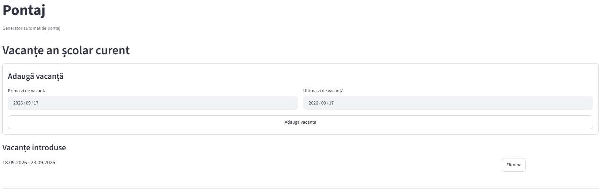
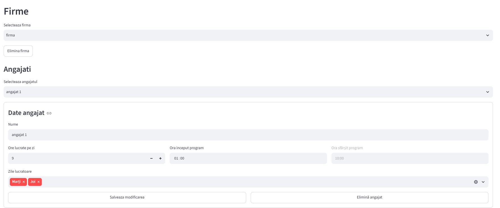
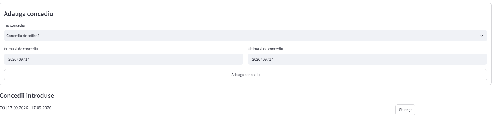
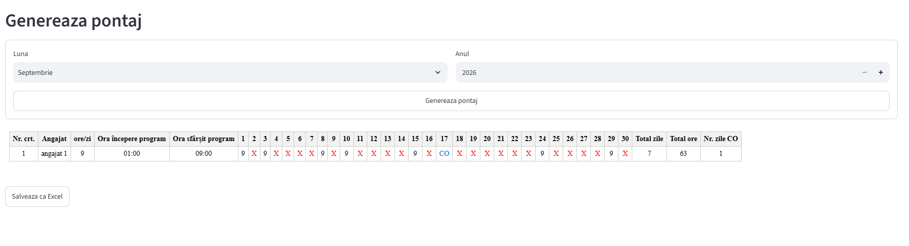
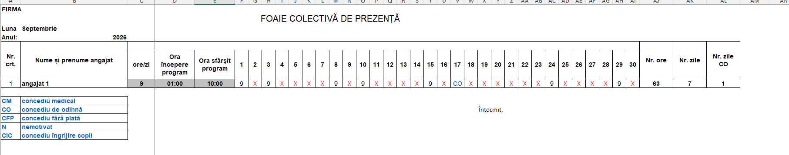

# Automatic Timesheet Generator

A Python application for automatically generating monthly employee timesheets based on individual work schedules, school holidays, and employee absences.

The project was built around a real administrative workflow and replaces repetitive manual timesheet preparation with an automated Streamlit application and formatted Excel export.

---

## Overview

Preparing monthly employee attendance sheets manually requires checking working schedules, weekends, holidays, employee leave periods, and total working hours for every employee.

This application automates that process.

The user can manage companies and employees, define individual schedules, register different types of leave, configure non-working periods, and generate a complete monthly timesheet automatically.

The final result can be previewed directly in the application and exported as a formatted Excel document ready for further use or printing.

---

## Key Features

- Manage multiple companies
- Add, edit, and delete employees
- Configure individual working schedules for each employee
- Select specific working days from Monday to Friday
- Define working hours per day
- Automatically calculate the end time from the start time and daily working hours
- Configure school holiday periods manually
- Add and remove employee leave periods
- Support multiple absence types:
  - `CO` – Annual leave
  - `CM` – Medical leave
  - `CFP` – Unpaid leave
  - `N` – Unexcused absence
  - `CIC` – Childcare leave
- Automatically detect:
  - weekends
  - school holidays
  - employee non-working days
  - employee leave periods
- Automatically calculate:
  - total working days
  - total working hours
  - annual leave days (`CO`)
- Preview the generated timesheet in the Streamlit interface
- Export the final result to a formatted Excel file
- Persist application data locally using SQLite

---

## Timesheet Logic

For every employee and every day of the selected month, the application determines the correct value automatically.

| Value | Meaning |
|---|---|
| Working hours | Regular working day |
| `X` | Weekend, school holiday, or employee non-working day |
| `CO` | Annual leave |
| `CM` | Medical leave |
| `CFP` | Unpaid leave |
| `N` | Unexcused absence |
| `CIC` | Childcare leave |

Only regular working days contribute to the employee's total worked days and total working hours.

The `Nr. zile CO` field counts only days marked as annual leave (`CO`).

---

## Technologies

- **Python** – application logic
- **Streamlit** – interactive web interface
- **SQLite** – persistent relational data storage
- **OpenPyXL** – Excel generation and formatting
- **HTML/CSS** – custom timesheet preview inside Streamlit

---

## Technical Highlights

The project demonstrates practical use of Python for:

- business process automation
- relational database design
- CRUD operations
- foreign-key relationships
- date and calendar logic
- dynamic employee scheduling
- state management in Streamlit
- Excel file generation
- Excel formatting with OpenPyXL
- separation of application, database, and business logic
- handling multiple business rules within a real workflow

---

## Project Structure

```text
timesheet/
│
├── app.py
├── database.py
├── main.py
│
├── docs/
│   ├── screenshot-1-holidays.png
│   ├── screenshot-2-employee-schedule.png
│   ├── screenshot-3-leave-management.png
│   ├── screenshot-4-timesheet-preview.png
│   └── screenshot-5-excel-output.png
│
├── requirements.txt
├── .gitignore
└── README.md
```

### Main Files

**`app.py`**
Contains the Streamlit interface and controls the user interaction flow.

**`database.py`**
Handles SQLite database creation and CRUD operations for companies, employees, workdays, leave periods, and school holidays.

**`main.py`**
Contains the timesheet generation logic and Excel export functionality.

**`docs/`**
Contains screenshots used in this README.

---

# Screenshots

## School Holiday Management

School holiday periods can be added and removed manually, allowing the timesheet generator to automatically exclude non-working school days.



---

## Employee Schedule Management

Each employee can have individual working days and daily hours, while the end time is calculated automatically from the selected start time and number of working hours.



---

## Leave and Absence Management

Leave periods can be added individually for each employee using predefined absence types such as annual leave, medical leave, unpaid leave, unexcused absence, and childcare leave.



---

## Timesheet Generation and Preview

The application generates the monthly timesheet automatically, applies working-day and absence rules, calculates totals, and provides an on-screen preview before Excel export.

`X` values are displayed in red, while leave and absence codes are highlighted in blue.



---

## Excel Export

The generated timesheet is exported to a formatted Excel file containing employee schedules, daily attendance values, working-day totals, annual leave totals, and an absence-code legend.

The document is formatted for landscape A4 printing.



---

## Database Structure

The application uses SQLite for local persistent storage.

The database stores:

- companies
- employees
- employee working days
- employee leave periods and absence types
- school holiday periods

Foreign-key relationships are used to maintain consistency between companies, employees, schedules, and leave records.

---

## Installation

Clone the repository:

```bash
git clone https://github.com/DeliaDiaconita/automatic-timesheet-generator.git
```

Navigate to the project directory:

```bash
cd automatic-timesheet-generator
```

Create a virtual environment:

```bash
python -m venv .venv
```

Activate the virtual environment on Windows:

```bash
.venv\Scripts\activate
```

Install the required dependencies:

```bash
pip install -r requirements.txt
```

---

## Running the Application

Start the Streamlit application:

```bash
streamlit run app.py
```

Streamlit will open the application in your browser.

---

## How to Use

1. Add the school holiday periods.
2. Create or select a company.
3. Add employees.
4. Configure each employee's working days and daily schedule.
5. Add leave or absence periods when necessary.
6. Select the month and year.
7. Generate the monthly timesheet.
8. Review the generated preview.
9. Export the final timesheet to Excel.

---

## Excel Output

The generated Excel file includes:

- company name
- selected month and year
- employee names
- working hours per day
- automatically calculated start and end times
- one column for each calendar day
- working hours or absence code for each day
- total working hours
- total working days
- total annual leave days
- absence-code legend

The exported document also uses visual formatting to improve readability:

- `X` values are displayed in red
- leave and absence codes are displayed in blue
- schedule information is highlighted
- table borders and column widths are automatically formatted

---

## Project Motivation

This project was developed to solve a real administrative problem: creating monthly employee timesheets while accounting for different working schedules, non-working periods, and employee absences.

Instead of preparing attendance sheets manually, the application centralizes the required information and generates the final document automatically.

The project combines database management, business-rule implementation, user-interface development, date processing, and document generation in a complete end-to-end Python application.

---


